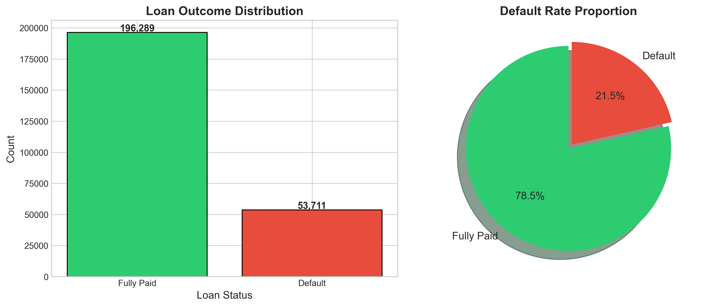
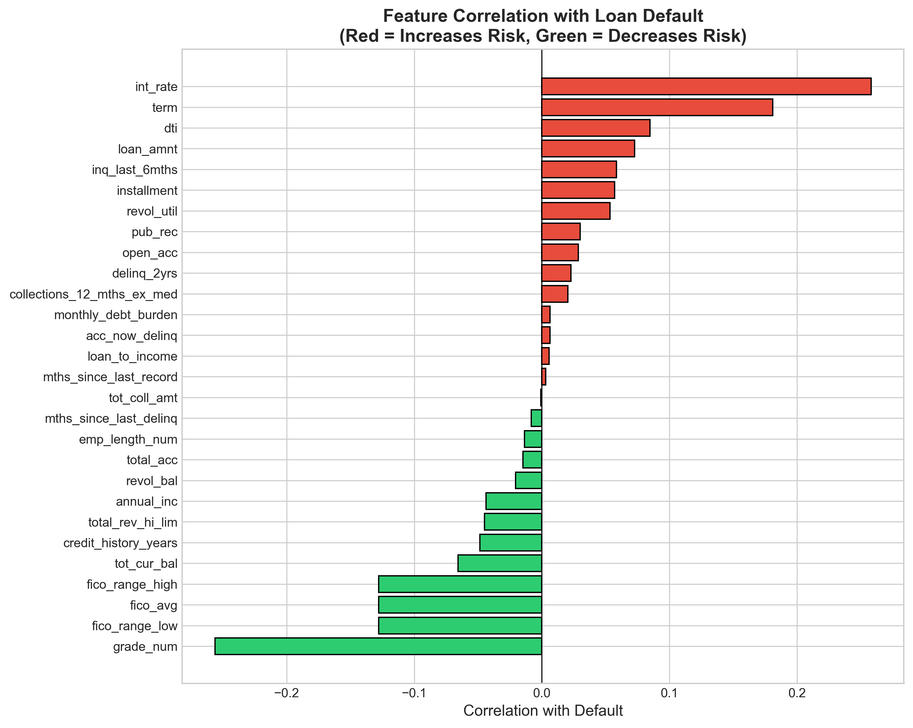
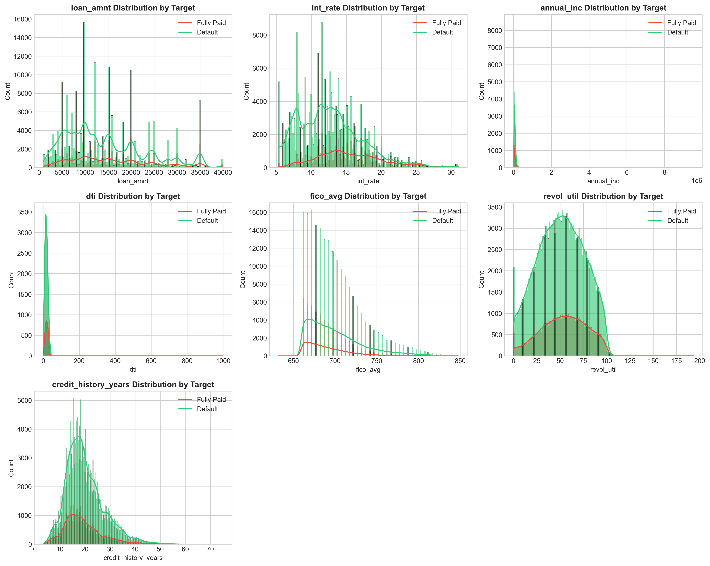
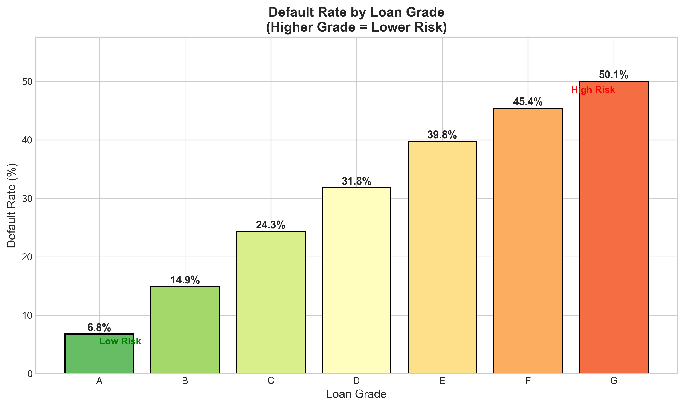

#  Data Analytics Portfolio

Hi! I'm **Makuochukwu**, a Computer Science student passionate about turning data into actionable insights. This portfolio showcases my projects in data analysis, machine learning, and business intelligence.

---

## About Me

I'm currently pursuing my degree at EPITA International Programs, with a focus on data science and analytics. I enjoy working with messy real-world datasets and building models that solve actual business problems.

**Areas of Interest:**
- Credit Risk & Financial Analytics
- Healthcare Data Analysis  
- Machine Learning & Predictive Modeling
- Data Visualization & Dashboards

---

##  Technical Skills

**Languages & Libraries**
```
Python (pandas, NumPy, scikit-learn, matplotlib, seaborn, Plotly)
SQL (PostgreSQL, MySQL, SQLite)
```

**Machine Learning**
```
Classification, Regression, Clustering
XGBoost, Random Forest, Logistic Regression
Model Evaluation & Feature Engineering
```

**Tools & Platforms**
```
Jupyter Notebook, Git/GitHub
Tableau, Power BI, Excel
Google Colab
```

---

## Projects

```
credit-risk-model/
├── data/
│   ├── raw/                    # Original Lending Club data
│   └── processed/              # Cleaned and featured data
├── notebooks/
│   ├── 01_data_cleaning.ipynb
│   ├── 02_eda.ipynb
│   ├── 03_feature_engineering.ipynb
│   ├── 04_modeling.ipynb
│   └── 05_business_metrics.ipynb
├── models/
│   └── xgboost_model.pkl       # Trained model
├── images/
│   ├── correlation_heatmap.png
│   ├── default_by_grade.png
│   └── roc_curve.png
├── README.md
├── requirements.txt
├── PROJECT_SUMMARY.md
└── EXECUTION_GUIDE.md
```


### 1. Credit Risk Assessment Model
**Predicting loan defaults using Lending Club data**

Built a classification model to predict which borrowers are likely to default on their loans. This helps financial institutions make better lending decisions and reduce portfolio risk.

- **Dataset**: 250,000 loans from Lending Club (2007-2018)
- **Techniques**: Logistic Regression, Random Forest, XGBoost
- **Key Metrics**: ROC-AUC, Expected Loss calculation
- **Tools**: Python, pandas, scikit-learn, Plotly

📈 [View Project Details](./PROJECT_SUMMARY.md) | 📓 [Notebooks](./notebooks/) | 📋 [Execution Guide](./EXECUTION_GUIDE.md)

---

### 2. *Coming Soon: Healthcare Analytics Project*
Analyzing patient data to predict readmission rates...

---


##  Sample Visualizations









**Interactive Charts:**
- [Default by Grade (Interactive)](./images/03_default_by_grade_interactive.html)

---

## 📫 Let's Connect

- **LinkedIn**: https://www.linkedin.com/in/okoene-makuo-56932b259/
- **Email**: okoenemakuo04@outlook.com
- **GitHub**: [@Evelynval-w](https://github.com/Evelynval-w)

---

## 📝 Notes

These projects were completed as part of my learning journey in data science. Each project includes detailed documentation, clean code, and reproducible notebooks. Feel free to explore and reach out if you have questions!

---

*Last updated: December 2025
